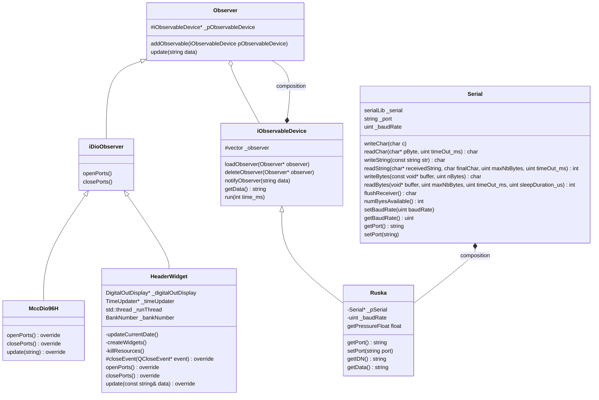

# SkerlBox Class Diagrams

```mermaid
classDiagram
class Serial {
  serialLib _serial
  string _port
  uint _baudRate
  writeChar(char c)
  readChar(char* pByte, uint timeOut_ms) char
  writeString(const string str) char
  readString(char* receivedString, char finalChar, uint maxNbBytes, uint timeOut_ms) int
  writeBytes(const void* buffer, uint nBytes) char
  readBytes(void* buffer, uint maxNbBytes, uint timeOut_ms, uint sleepDuration_us) int
  flushReceiver() char
  numByesAvailable() int
  setBaudRate(uint baudRate)
  getBaudRate() uint
  getPort() string
  setPort(string)
}


class Observer {
  #iObservableDevice* _pObservableDevice
  addObservable(iObservableDevice pObservableDevice)
  update(string data) 
}


class iDioObserver {
  openPorts()
  closePorts()
}
Observer <|-- iDioObserver

iDioObserver <|--MccDio96H
class MccDio96H {
  openPorts() override
  closePorts() override
  update(string) override
}

iDioObserver <|--HeaderWidget
class HeaderWidget {
  DigitalOutDisplay* _digitalOutDisplay
  TimeUpdater* _timeUpdater
  std::thread _runThread
  BankNumber _bankNumber
  -updateCurrentDate()
  -createWidgets()
  -killResources()
  #closeEvent(QCloseEvent* event) override
  openPorts() override
  closePorts() override
  update(const string& data) override
}

class iObservableDevice {
  #vector<Observer*> _observer 
  loadObserver(Observer* observer)
  deleteObserver(Observer* observer)  
  notifyObserver(string data) 
  getData() string
  run(int time_ms) 
}
Observer o-- iObservableDevice
iObservableDevice *-- Observer : composition


iObservableDevice <|-- Ruska
Serial *-- Ruska : composition
class Ruska {
  -Serial* _pSerial
  -uint _baudRate
  getPort() string
  setPort(string port)
  getIDN() string
  getData() string
  getPressureFloat float
}


```
